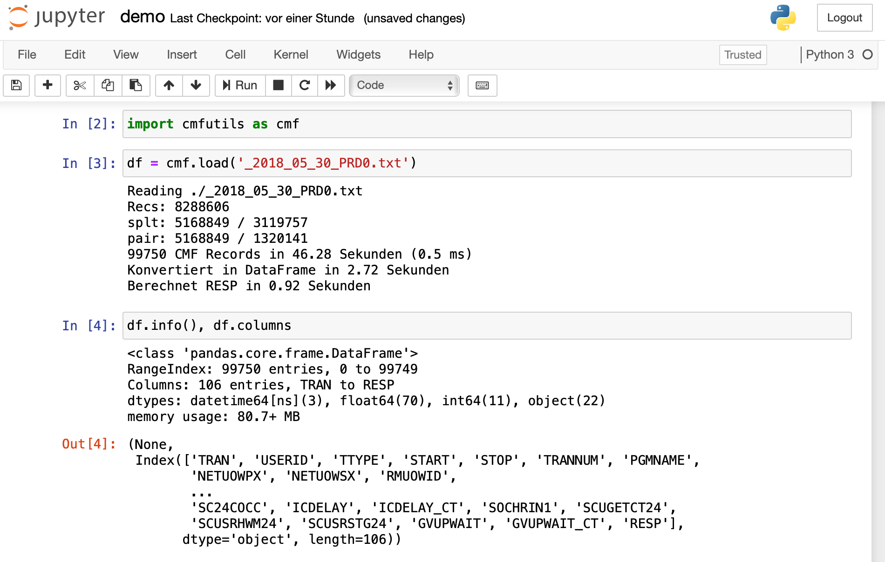
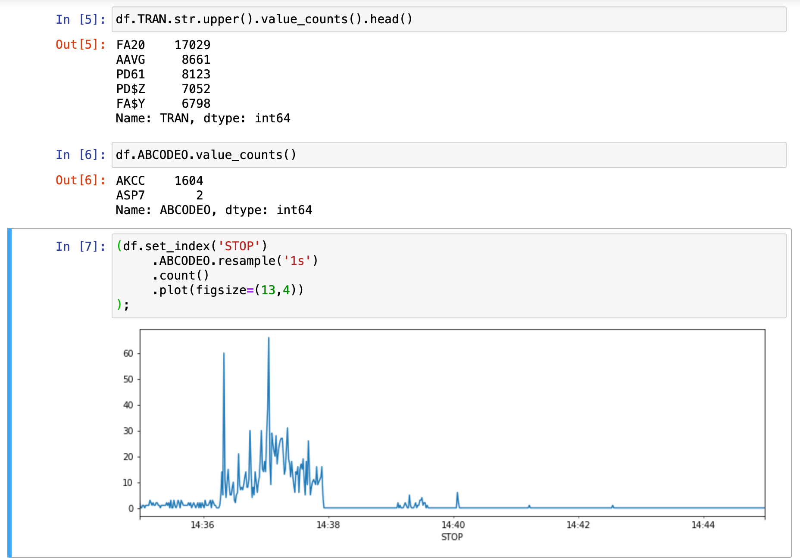
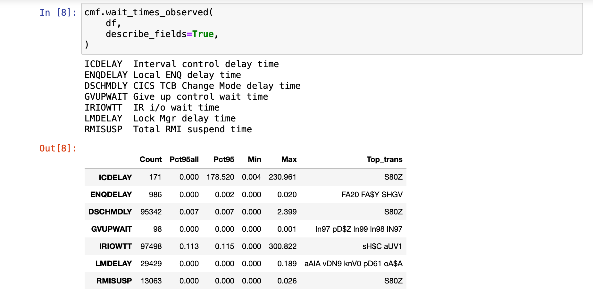

# cmfutils
Python package to transform [CICS Monitoring Facility](https://www.ibm.com/support/knowledgecenter/en/SSGMCP_5.5.0/fundamentals/monitoring/workload_lp_cmf.html) performance class data into pandas dataframe using DFH$MOLS output.
Some sample scripts for analysis of the data with the help pandas are provided.
Short description of CMF fields is included.

## Prereqs
 1. You love CICS
 1. You know how to run [DFH$MOLS](https://www.ibm.com/support/knowledgecenter/en/SSGMCP_5.5.0/reference/utilities/dfha61u.html#dfha61u) to generate input data.
 1. Python3 with pip and [pandas](https://pandas.pydata.org/docs/)

## Install the package
From setup directory run
```
    pip install -e .
```

## Demo Session with Jupyter
Download output of DFH$MOLS as ascii text file and start a Jupyter session.

Import cmfutils and load the file into a pandas data frame: 



Now you are ready to perform some analysis with pandas or use pandas to export the data to csv or excel and so on.


The function wait\_times\_observed() is an example how to quickly identify possible issues in a CICS region.


